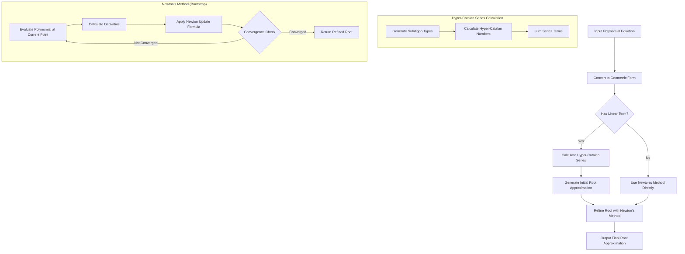

# Hyper-Catalan Polynomial Solver (Rust)

A Rust implementation of the Hyper-Catalan series method for solving polynomial equations, based on the paper "A Hyper-Catalan Series Solution to Polynomial Equations, and the Geode" by N.J. Wildberger and K.W. Rubin.

## Overview

This project implements a novel approach to finding roots of polynomial equations using Hyper-Catalan numbers and series. The method is particularly interesting from a theoretical perspective, connecting algebraic solutions to combinatorial structures called subdigons.

## Features

- High-precision arithmetic using Rust's `num` crate
- Implementation of Hyper-Catalan number calculations
- Conversion between standard polynomial form and geometric form
- Series approximation of polynomial roots
- Newton's method for refining root approximations
- Comprehensive test suite

## Dependencies

- Rust 2021 edition
- `num` crate for arbitrary precision arithmetic
- `nalgebra` (as an alternative to Eigen)
- `clap` for command line argument parsing (in the full version)
- `approx` for floating-point comparisons in tests

## Building

```bash
cargo build --release
```

## Running

```bash
cargo run --release
```

The program will prompt you to enter:
1. The degree of the polynomial
2. The coefficients (from constant term to highest degree)
3. Initial guess for bootstrap method (optional)
4. Number of iterations for bootstrap method

## Testing

```bash
cargo test
```

## Mathematical Background

### Hyper-Catalan Numbers

Hyper-Catalan numbers are a generalization of Catalan numbers, defined for a tuple (m₂, m₃, m₄, ...) representing the number of faces with different polygon sizes. For a subdigon type m = (m₂, m₃, m₄, ...), the corresponding Hyper-Catalan number is:

```
C_m = (2m₂ + 3m₃ + 4m₄ + ...)! / ((1 + m₂ + 2m₃ + 3m₄ + ...)! · m₂! · m₃! · m₄! · ...)
```

### Polynomial Solving

The method works by transforming a polynomial equation into a geometric form:

```
1 - a + t₂a² + t₃a³ + ... = 0
```

Then, using the Hyper-Catalan series, we can find the root of this equation as:

```
a = ∑ C_m · t₂^m₂ · t₃^m₃ · t₄^m₄ · ...
```

The sum is over all possible subdigon types.

## Algorithm Flow

Below is a flowchart of the algorithm used for solving polynomial equations:



## C++ vs Rust Implementation Comparison

This project is a Rust port of the original C++ implementation. Here are some key differences and similarities:

### Architecture

Both implementations share the same overall structure:
- A `SubdigonType` struct for representing subdigon types
- A calculator for Hyper-Catalan numbers with caching
- A polynomial solver that uses the Hyper-Catalan series method
- Newton's method for refining root approximations

### Differences

1. **High-precision arithmetic**: 
   - C++: Uses Boost's `cpp_dec_float_50` type
   - Rust: Uses the `num` crate with `BigRational` for exact calculations

2. **Memory management**:
   - C++: Requires manual memory management in some cases
   - Rust: Provides memory safety guarantees with its ownership system

3. **Error handling**:
   - C++: Uses exceptions (`std::invalid_argument`)
   - Rust: Uses the `Result<T, E>` type for error handling

4. **Performance**:
   - Both implementations should offer comparable performance, though the C++ version might have an edge in raw computational speed
   - Rust provides better safety guarantees without significant performance penalties

### Implementation Details

The Rust implementation makes several modern design choices:
- Uses Rust's trait system for extensibility
- Leverages pattern matching for cleaner code
- Provides clearer error messages and handling
- Uses idiomatic Rust approaches to problems

## Author

Eugen Soloviov
- Email: suenot@gmail.com
- Telegram: [@suenot](https://t.me/suenot)

## License

This project is licensed under the MIT License - see the LICENSE file for details.

## Citation

If you use this implementation in your research, please cite the original paper:

```
Wildberger, N.J., & Rubin, K.W. (2023). A Hyper-Catalan Series Solution to Polynomial Equations, and the Geode.
``` 